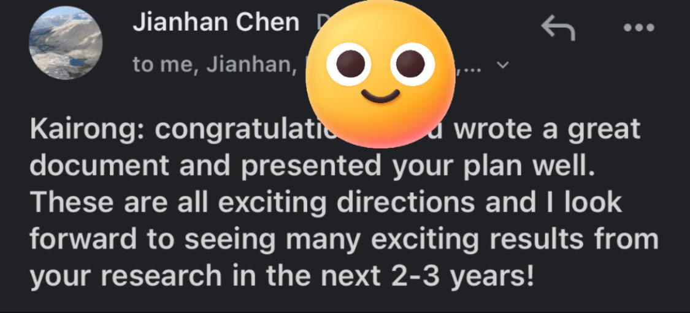
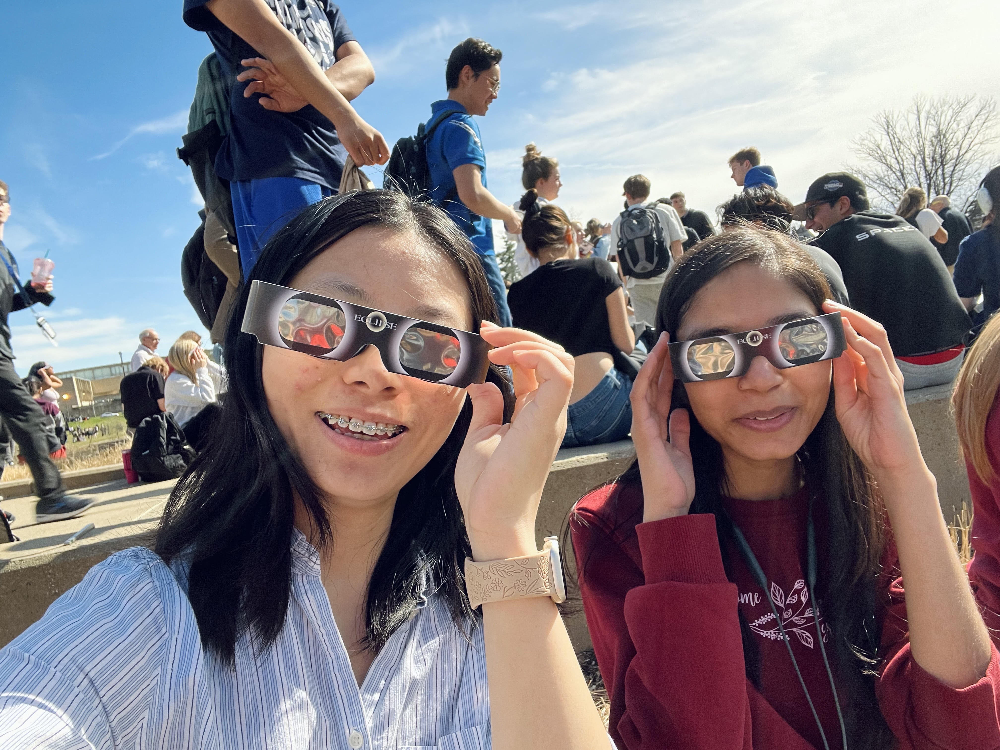
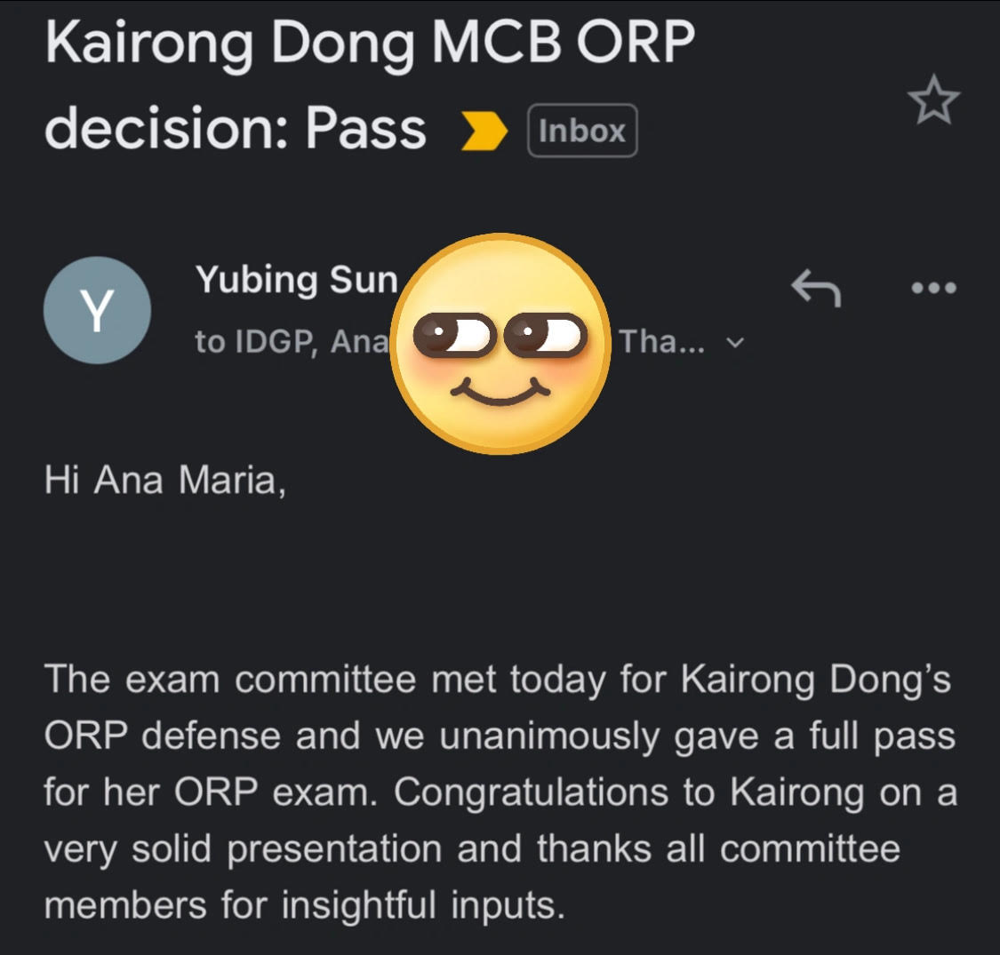
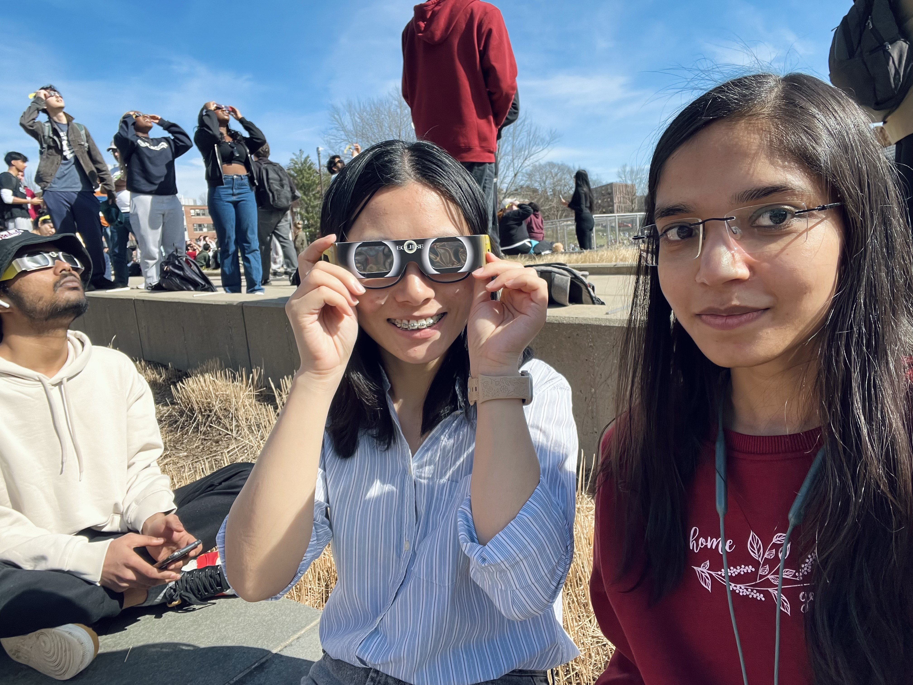



  December 12, 2024

Congratulations to Kairong for finishing her prospectus presentation. It was a great meeting with the committee members. She got a lot of positive feedback and suggestions about the projects she is working on. She will be focusing on the projects and enjoy the rest of the journey! Many thanks for people supported her!

    <figure style="display: inline-block; margin: 0;">
        
        <figcaption style="display: block; margin-top: 0px; font-family: 'Fredoka One', sans-serif; font-size: 14px; color: #555;">
      Encouragement from Professor
        </figcaption>
    </figure>

  April 08, 2024

Congratulations to Kairong for passing her ORP exam with a full pass! This is a special day with the total solar eclipse happening in some area of the US. She was joking, "It is literally the darkest day!" After the presentation, she went for the observation of Solar Eclipse in campus with her collageue and felt that chillness and dimness when the sun is mostly blocked (94.6% in Amherst). Many thanks for people supported her!

    <figure style="display: inline-block; margin: 0;">
                                 
        <figcaption style="display: block; margin-top: 0px; font-family: 'Fredoka One', sans-serif; font-size: 14px; color: #555;">
      Dual Happiness
        </figcaption>
    </figure>

  March 16, 2023

Today, Kairong officially joined the home lab: Professor Jianhan Chen's lab! She will be switching from the wet lab to a dry lab. Courage and tenacity will pave the road for her! She always think of the first day she joined the lab meeting in the meeting room of LSL 6th floor with the snowflakes falling outside of the window and the world outside is all white and quietness. 

  January 23, 2022

Today, Kairong started her third rotation in professor Jianhan Chen's lab and professor Meg Stratton's lab! Here she worked on a project related to dynamics of protein with disordered region: "Investigating the Dynamics of CaMKII with Different Linkers". She worked with the help of a third year phD candidate Jian Huang and other lab members and collaborated with a third year phD candidate Bao Nguyen!

  November 21, 2022

Today, Kairong started her second rotation in professor Changhui Pak's lab! Here she worked on a project related to neuronal development and diseases: "Investigation of Wnt Signaling in CASK-KO Human Cortical Excitatory Neurons". She worked with the help of a fifth year phD candidate Danny McSweeney and other lab members!

  September 19, 2022

Today, Kairong started her first rotation in professor Peter Chien's lab! Here she worked on a project related to protein degradation: "Finding New Substrates of Lon Protease in Caulobacter". She works with the help of a fifth year phD candidate Justyne Ogdahl and other lab members!

  August 25, 2022

Hi Amherst! Today, Kairong arrived at the pretty and quiet town: Amherst. Thanks to Xinjun Gao from the ACCC who picked her up from the BDL airport! She was impressed by the pretty summer senery of Massachusett!

